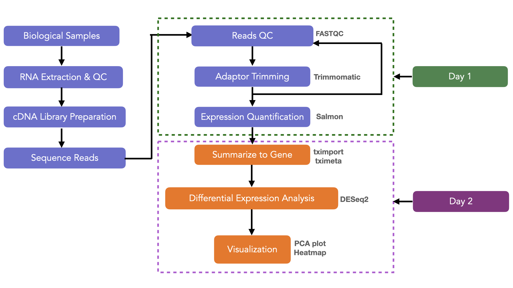

RNA-Seq Differential Expression Analysis
========================================

**When:**

**Instructor:**  

**Helpers:**

**Zoom:**

**Day 1 Notes:**

While we wait to get started –

1.  Click this button
    
    to start a virtual machine. It can take up to 20 minutes for them
    all to start with this many participants so we’re going start them
    and talk about the differential expression (DE) pipeline we’re using
    while they all spin up.

2.  ✅ Have you looked at the [pre-workshop resources
    page](https://github.com/nih-cfde/training-and-engagement/wiki/Resources-for-Workshop-Attendees)?

3.  ✏️ Please fill out our pre-workshop survey if you have not already
    done so! Link here:
    <a href="https://forms.gle/6oesZ7h789xbYLc29" class="uri">https://forms.gle/6oesZ7h789xbYLc29</a>

Put up a ✋ on Zoom when you’ve *clicked* the launch binder link! (It
takes a few minutes to load, so we’re getting it started before the
hands-on activities)

Introductions
=============

I am a postdoc at UC Davis and part of the training and engagement team
for the [NIH Common Fund Data Ecosystem](https://nih-cfde.org/), a
project supported by the NIH to increase data reuse and cloud computing
for biomedical research.

You can contact me at
<a href="mailto:achar@ucdavis.edu" class="email">achar@ucdavis.edu</a>

Links to papers we mention and other useful references are here:
<a href="https://hackmd.io/vxZ-4b-SSE69d2kxG7D93w" class="uri">https://hackmd.io/vxZ-4b-SSE69d2kxG7D93w</a>

Conceptual Overview
===================

Learning Objectives
-------------------

-   Create a gene-level count matrix of Salmon quantification using
    tximport
-   Perform quality control and exploratory visualization of RNA-Seq
    data in R
-   Try very hard not to go on a fishing expedition!
-   Perform differential expression of a single factor experiment in
    DESeq2
-   Learn how to make your own analysis reproducible

About this lesson
-----------------

During this lesson, you’ll learn how to use RMarkdown for reproducible
data analysis, if you want to learn more,
[this](https://rpubs.com/marschmi/RMarkdown) is a great RMarkdown
tutorial. This tutorial was written using data from [Schurch et
al.](http://rnajournal.cshlp.org/content/22/6/839.long), where wildtype
(WT) and Δsnf2 mutation () yeast were compared to test the underlying
distribution of RNA-Seq data, and to test which differential expression
programs work best. They had 672 samples, we’ll use 6 of them. These are
the same samples we worked with on Day One.

To make things go more quickly, and make it more like a real analysis,
we’ve pre-loaded the results from Day One into your Binder.

The pipeline we’re using is **Trimmomatic -&gt; Salmon -&gt; TPM -&gt;
DESeq2**:

 from:
(<a href="http://dx.doi.org/10.1038/s41598-020-76881-x" class="uri">http://dx.doi.org/10.1038/s41598-020-76881-x</a>)

That image makes it look like we only really have one thing to do today,
but we actually have several:

1.  Get our read counts into R
2.  Explore the input data
3.  Run a model in DESeq2 find the differentially expressed (DE) genes
4.  Explore the results

Getting your read counts into R
===============================

Unless you are using a differential expression tool that specifically
requires you to do normalizaiton before adding your counts, you
shouldn’t do anything to your raw counts before importing them. All of
the modern DE tools that I know of use algorithms that assume
un-normalized counts, and giving them normalized data will result in
incorrect modeling of the data and bad results. The values in your
initial count matrix should be un-normalized counts or estimated counts
of sequencing reads (for single-end RNA-seq) or fragments (for
paired-end RNA-seq).

Tximeta
-------

We’re going to import the raw counts from Salmon into DESeq2 using a
package called
[tximeta](https://bioconductor.org/packages/release/bioc/html/tximeta.html).
We’re using this package because it was custom created by the makers of
Salmon and DESeq2 to be a bridge between their tools.

To use `tximeta`, you supply the name and location of the files you used
to get your read counts (the index, the transcriptome, etc) and the name
and location of the output files (the read counts). It then
automatically transforms all those pieces of data to put them into a new
format: a data structure in R called a “Summarized Experiment”, which is
what DESeq2 takes as input.

#### Reproducible Data Practice 👀

`tximeta` incorporates all of the metadata from your Salmon run
(e.g. transcript locations, transcript and genome source and version,
appropriate chromosome lengths, etc) for each transcriptome. This
ensures computational reproducibility by attaching critical annotation
information to the data object, such that exact quantifications can be
reproduced from raw data (all software versions are also attached to the
data object).

If you used a different mapping and counting pipeline, you would have to
build a “Summarized Experiment” structure yourself to get the data into
DESeq2, and thats a bit tricky to do, so this is another reason it’s
often good to use established pipelines: someone may have already
written helper scripts to automate computationally difficult steps. For
more information, see the [tximeta
vignette](https://bioconductor.org/packages/release/bioc/vignettes/tximeta/inst/doc/tximeta.html)

`tximeta` is built to start with output from Salmon,
[alevin](https://salmon.readthedocs.io/en/latest/alevin.html), or
[sailfish](http://www.cs.cmu.edu/~ckingsf/software/sailfish/), but it
will work as a bridge to any R differential expression tool that uses a
Summarized Experiment as input. Technically, `tximeta` is built on top
of `tximport`, and you can also use it to start from any counts output
tool that is supported by `tximport`, but in practice trying to get
other data into a format that `tximeta` can use isn’t really much easier
than just reformatting it to be a summarized experiment directly.

Quality Control and Exploratory Visualization (no fishing!)
-----------------------------------------------------------

In the RNA-Seq Concepts module, we talk a lot about experimental design,
and walk through a lot of examples about hypothetical data for a single
gene might look if you plotted it. In particular we looked at several
‘batch effects’ to see whether they were likely to have large effects on
our data.

Similarly, when you are starting your own data analysis, it is useful to
visually explore your data to help you make informed decisions about
your model. A thing that often comes up when we talk about exploring our
data is what is a fishing expedition or p-hacking, and what is merely
looking. As with all the other topics, this is a question without a
clear answer. Many people have written about the problem of fishing for
signifigant effects, and there are many opinions. This is my favorite
treatment of the subject because it is short, straightforward, and
addresses the biggest problems rather than the most sensational ones:
[The garden of forking paths: Why multiple comparisons can be a problem,
even when there is no “fishing expedition” or “p-hacking” and the
research hypothesis was posited ahead of
time∗](http://www.stat.columbia.edu/~gelman/research/unpublished/p_hacking.pdf)

If you’re looking for a more local opinion this is mine:

-   RNA-Seq is always a hypothesis generation tool and not a hypothesis
    confirmation tool
-   When you design your experiment, you should know and document ahead
    of time what your *variables of interest* are and use this tool to
    confirm or refute those ideas
-   If a sample appears to be an outlier and you cannot find any reason
    (mixed labels, poor recordkeeping, got left on the counter for 5
    hours, etc) for it to be ‘out of place’ then keep it and have an
    outlier: sometimes biology is messy, and [DESeq2 explicitly models
    for outliers and will remove any that truly don’t fit your
    data](https://bioconductor.org/packages/3.7/bioc/vignettes/DESeq2/inst/doc/DESeq2.html#approach-to-count-outliers)
-   If you are exploring your data and find a new, interesting looking
    correlation that is *not* one of your variables of interest that’s
    great! and interesting! and definitely something you should design a
    *new* experiment to explore, but you shouldn’t add it as a new
    explanatory variable now

I typically use data exploration for 2 things:

1.  To make sure that my data looks approximately correct
2.  To decide which blocking variables I should include: If I’ve
    recorded five blocking/batch variables in my data, it’s because I
    was concerned that these could cause an effect. It’s very unlikely
    that I have enough data that I can model out all five, so looking to
    find the one or two or three with the largest effect to model out is
    useful

DESeq2
------

The steps in DESeq2 are largely about accounting for bias and error due
to the biology itself. Your experiment won’t be sequencing one
individual as a control and one individual as a treatment to compare.
You’ll have sampled many individuals from both groups, and perhaps had
more than one treatement variable. Just as you wouldn’t expect any two
controls to grow to exactly the same size, or at exactly the same rate,
or have any other phenotype perfectly in sync, we wouldn’t expect two
controls to have exactly the same number of copies of each gene at a
given time- even if they’re clones. DESeq runs a complex algorithm to
try to distinguish the biological variation within treatment groups from
the variation due to your experimental intervention, as well as removing
things like blocking effects:

### Why we need to normalize and transform read counts?

Given a uniform sampling of a diverse transcript pool, the number of
sequenced reads mapped to a gene depends on:

-   its own expression level,
-   its length,
-   the sequencing depth,
-   the expression of all other genes within the sample.

In order to compare the gene expression between two conditions, we must
therefore calculate the fraction of the reads assigned to each gene
relative to the total number of reads and with respect to the entire RNA
repertoire which may vary drastically from sample to sample. While the
number of sequenced reads is known, the total RNA library and its
complexity is unknown and variation between samples may be due to
contamination as well as biological reasons. **The purpose of
normalization is to eliminate systematic technical and biological
effects that are not associated with the biological differences of
interest.**

1.  estimation of size factors sj by estimateSizeFactors
2.  estimation of dispersion ai by estimateDispersions
3.  negative binomial GLM fitting for βi and Wald statistics
    by nbinomWaldTest

### Pipeline Steps

-   Estimation of Size Factors: These are internal normalization factors
    that account for differences in library depth. What it’s trying to
    do is to estimate how much each gene varies in the overall dataset
    as a way to normalize out any variation due entirely to differences
    in how many reads a sample got

-   Estimation of Dispersion: Dispersion is a measure of variation,
    similar to a variance or standard deviation. Specifically in DESeq2,
    dispersion is measuring the variation of a gene within biological
    replicates for a given treatment. Since measures of variation are
    very unreliable unless you have lots of replicates, DESeq2 ‘borrows’
    information by assuming that genes with similar mean expression
    levels will also have similar dispersions. These values will be used
    in the shrink LFCs step

-   Wald test or likelihood ratio test: the Wald test is useful for
    testing whether a single treatment had an effect. It’s what we’ll
    use today with our control vs. Δsnf2 data. The likelihood ratio test
    is useful for testing multiple terms at once, so if our data had a
    more complex treatment like a control, a Δsnf2 mutant, and a
    snf2-duplication mutant, we’d use the LRT

-   Build results table: just what it sounds like, the gene info,
    relative expression levels, and signifigance test info get saved in
    the Summarised Experiment object

-   Shrink LFCs: The ‘magic’ of DESeq2 is the way that it ‘shares’
    information across different parts of the dataset in a rigorous way
    to better estimate the variation of the data from different angles
    so it can create a better result. It uses this information to change
    the log fold change value- the amount of difference there is between
    treatment- for each gene based on all of that information about how
    variation acts in the dataset as a whole

[This outdated
tutorial](https://hbctraining.github.io/DGE_workshop/lessons/04_DGE_DESeq2_analysis.html)
is no longer useful in terms of commands- the algorithm of DESeq2 has
changed a bit since this was written- BUT, it has a lot of good
description of those algorithm pieces in a bit more detail.

#### DESeq2 Quick Facts

-   The underlying algorithm is trying to fit your data to a negative
    binomial distribution, that is, one that doesn’t have negative
    numbers (you don’t get minus 5 reads), that is discrete (has a
    countable number of variables), that the total of the variables add
    to 1 (transcripts from gene 1 + gene 2 + gene 3….gene X = 100% of
    the transcripts you mapped), and that acts like combining together a
    bunch of Bernoulli trials (the coin flip distribution, so think: did
    this gene get a read? yes/no)
-   The ‘magic’ of DESeq2 is that it *shares data across replicates and
    treatments* to improve it’s estimates
-   This means that it *cannot* be run without biological replicates
-   Technical replicates do not really improve it’s accuracy
-   DESeq2 will allow you to find more reliable DE between low
    expression genes, but will underestimate differences between high
    expression genes
-   The base assumption of DESeq2 is that *most genes are **not**
    differentially expressed*. It is trying to find only the ‘most real’
    looking differences and can be very conservative
-   It is most effective on datasets with a small but reasonable number
    of biological replicates per modeled effect (at least 3, preferably
    5, fewer than 12)
-   There are [specific
    changes](https://bioconductor.org/packages/3.7/bioc/vignettes/DESeq2/inst/doc/DESeq2.html#recommendations-for-single-cell-analysis)
    you should make to your analysis if you are using single cell data
-   For a lot more see the [DESeq2
    vignette](https://bioconductor.org/packages/3.7/bioc/vignettes/DESeq2/inst/doc/DESeq2.html)

❓ Questions?

Did the binder load? Put up a ✋ on Zoom if you see Rstudio in your web
browser.

Running the workflow
====================

Install and setup
-----------------

Since we’re working in binder, all of the R packages are already
installed. If you’d like to do a similar analysis on your own system,
you can use the following installation commands:

    # Don't run this in today's binder, it's just for reference!

    install.packages("ggplot2")
    install.packages("dplyr")
    install.packages("readr")
    install.packages("pheatmap")
    # install.packages('RSQlite')
    install.packages("data.table")
    install.packages("kableExtra")
    install.packages("reshape2")
    if (!requireNamespace("BiocManager", quietly = TRUE)) install.packages("BiocManager",
        version = "3.11")
    BiocManager::install("tximeta")
    BiocManager::install("DESeq2")
    BiocManager::install("SummarizedExperiment")
    BiocManager::install("apeglm")

#### ‼️ Tip

In Rmarkdown you can run sets of commands by:

-   Putting your cursor in a set and pressing Command+Shift+Enter on
    your mac
-   Putting your cursor in a set and pressing pressing Ctrl+Shift+Enter
    on your windows machine
-   Clicking the little play button (the green arrow) on the set you
    want

The packages are installed, but we still need to turn them on, we do
that with these commands:

    # Loading packages
    library(SummarizedExperiment)
    library(tximeta)
    library(DESeq2)
    library(dplyr)
    library(ggplot2)
    library(readr)
    library(pheatmap)
    library(kableExtra)
    library(reshape2)
    library(apeglm)

Use tximeta to import and format the data
-----------------------------------------

First let’s read in our `rnaseq_samples.csv` file. This file contains
the names of our samples, their conditions, and the path to their
quantification files. We’re saving it as the variable ‘samples’:

    # import file of sample info
    samples <- read_csv("rnaseq_samples.csv")

We can look at the contents of ‘samples’ and see that it’s an excel like
object with rows and columns of info:

    # look at sample info
    head(samples)

    ## # A tibble: 6 × 3
    ##   names     files                                 condition
    ##   <chr>     <chr>                                 <chr>    
    ## 1 ERR458493 rnaseq/quant/ERR458493_quant/quant.sf wt       
    ## 2 ERR458494 rnaseq/quant/ERR458494_quant/quant.sf wt       
    ## 3 ERR458495 rnaseq/quant/ERR458495_quant/quant.sf wt       
    ## 4 ERR458500 rnaseq/quant/ERR458500_quant/quant.sf snf2     
    ## 5 ERR458501 rnaseq/quant/ERR458501_quant/quant.sf snf2     
    ## 6 ERR458502 rnaseq/quant/ERR458502_quant/quant.sf snf2

Next we need to define our reference files, and we do this in the same
basic way, assigning each to a variable name. Some of the files we’re
assigning to variables are ones we created last time, the others are the
transcriptome files we downloaded last time. Giving tximeta the ensembl
reference files allows it to use both the transcript level information
we have from our counts, and to use gene location information to relate
transcripts to genes:

    # the count files from last time and the index
    indexDir <- file.path("rnaseq", "quant", "sc_ensembl_index")

    # The same reference files from last time
    gtfLocal <- "yeast_ref/Saccharomyces_cerevisiae.R64-1-1.99.gtf.gz"
    fastaLocal <- "yeast_ref/Saccharomyces_cerevisiae.R64-1-1.cdna.all.fa.gz"

With this information set, we can now build the object that saves all
these data and metadata together by assigning each of the variables or
pieces of metadata from our experiment to it’s place in `tximeta`:

    # assign variables to tximeta
    makeLinkedTxome(indexDir = indexDir, source = "Ensembl", organism = "Saccharomyces cerevisiae",
        release = "99", genome = "GCA_000146045.2", fasta = fastaLocal, gtf = gtfLocal,
        write = FALSE)

Once our data is inside the `tximeta` data object, we want it to
transform the information into a “Summarized Experiment”. Here we’re
very creatively calling our new Summarized Experiment object `se`:

To create an `se` object using our `tximeta` information:

    # turn info into a summarized experiment object
    se <- tximeta(samples)

It’s useful to do spot checks that our data manipulations continue to
look right. Let’s look at our new `se` object:

    # look at the new summarized experiment object
    colData(se)

    ## DataFrame with 6 rows and 2 columns
    ##                 names   condition
    ##           <character> <character>
    ## ERR458493   ERR458493          wt
    ## ERR458494   ERR458494          wt
    ## ERR458495   ERR458495          wt
    ## ERR458500   ERR458500        snf2
    ## ERR458501   ERR458501        snf2
    ## ERR458502   ERR458502        snf2

    assayNames(se)

    ## [1] "counts"    "abundance" "length"

    rowRanges(se)

    ## GRanges object with 6571 ranges and 9 metadata columns:
    ##                  seqnames          ranges strand |          tx_id
    ##                     <Rle>       <IRanges>  <Rle> |    <character>
    ##     YBR024W_mRNA       II   289445-290350      + |   YBR024W_mRNA
    ##     YDL245C_mRNA       IV     11657-13360      - |   YDL245C_mRNA
    ##     YBR232C_mRNA       II   683373-683732      - |   YBR232C_mRNA
    ##   YDR320W-B_mRNA       IV 1108484-1108621      + | YDR320W-B_mRNA
    ##     YBR021W_mRNA       II   281443-283344      + |   YBR021W_mRNA
    ##              ...      ...             ...    ... .            ...
    ##          YCL074W      III       2824-3750      + |        YCL074W
    ##          YAR061W        I   218140-219145      + |        YAR061W
    ##          YCL075W      III       2126-2566      + |        YCL075W
    ##          YIL171W       IX     19515-19844      + |        YIL171W
    ##          YPL275W      XVI     18369-19079      + |        YPL275W
    ##                      tx_biotype tx_cds_seq_start tx_cds_seq_end     gene_id
    ##                     <character>        <integer>      <integer> <character>
    ##     YBR024W_mRNA protein_coding           289445         290350     YBR024W
    ##     YDL245C_mRNA protein_coding            11657          13360     YDL245C
    ##     YBR232C_mRNA protein_coding           683373         683732     YBR232C
    ##   YDR320W-B_mRNA protein_coding          1108484        1108621   YDR320W-B
    ##     YBR021W_mRNA protein_coding           281443         283344     YBR021W
    ##              ...            ...              ...            ...         ...
    ##          YCL074W     pseudogene             <NA>           <NA>     YCL074W
    ##          YAR061W     pseudogene             <NA>           <NA>     YAR061W
    ##          YCL075W     pseudogene             <NA>           <NA>     YCL075W
    ##          YIL171W     pseudogene             <NA>           <NA>     YIL171W
    ##          YPL275W     pseudogene             <NA>           <NA>     YPL275W
    ##                  tx_support_level  tx_id_version gc_content        tx_name
    ##                         <integer>    <character>  <numeric>    <character>
    ##     YBR024W_mRNA             <NA>   YBR024W_mRNA    39.9558   YBR024W_mRNA
    ##     YDL245C_mRNA             <NA>   YDL245C_mRNA    41.9014   YDL245C_mRNA
    ##     YBR232C_mRNA             <NA>   YBR232C_mRNA    44.1667   YBR232C_mRNA
    ##   YDR320W-B_mRNA             <NA> YDR320W-B_mRNA    34.7826 YDR320W-B_mRNA
    ##     YBR021W_mRNA             <NA>   YBR021W_mRNA    39.9054   YBR021W_mRNA
    ##              ...              ...            ...        ...            ...
    ##          YCL074W             <NA>        YCL074W    43.5814        YCL074W
    ##          YAR061W             <NA>        YAR061W    42.1471        YAR061W
    ##          YCL075W             <NA>        YCL075W    41.9501        YCL075W
    ##          YIL171W             <NA>        YIL171W    42.4242        YIL171W
    ##          YPL275W             <NA>        YPL275W    43.0380        YPL275W
    ##   -------
    ##   seqinfo: 17 sequences (1 circular) from R64-1-1 genome

    seqinfo(se)

    ## Seqinfo object with 17 sequences (1 circular) from R64-1-1 genome:
    ##   seqnames seqlengths isCircular  genome
    ##   I            230218      FALSE R64-1-1
    ##   II           813184      FALSE R64-1-1
    ##   III          316620      FALSE R64-1-1
    ##   IV          1531933      FALSE R64-1-1
    ##   IX           439888      FALSE R64-1-1
    ##   ...             ...        ...     ...
    ##   XII         1078177      FALSE R64-1-1
    ##   XIII         924431      FALSE R64-1-1
    ##   XIV          784333      FALSE R64-1-1
    ##   XV          1091291      FALSE R64-1-1
    ##   XVI          948066      FALSE R64-1-1

#### Exercise ✍️

What do these different checks tell you?

-   `colData(se)`: Our sample names and treatments
-   `assayNames(se)`: What data we imported from Salmon
-   `rowRanges(se)`: Metadata about transcripts, what strand they are
    on, what kind of gene they belong to, their location, etc
-   `seqinfo(se)`: High level information about the genome structure

Finally, we have `tximeta` use the information about transcript location
to summarize the count results to the gene level:

    # summarize to gene
    gse <- summarizeToGene(se)

Data Exploration
----------------

Before we run DESeq2 it’s useful to look at our *unmodeled* data to make
some decisions about how we should run the modeling, and to ensure our
data looks right.

#### Reproducible Data Practice 👀

To do both these things, we’ll have to do some transformations and
normalizations of the raw data so that it will plot. Notice as we go
thorough that we’re always putting that transfomed/normalized data in a
new variable and *not* saving it to our `se` variable

-   Never do your *exploration* on modeled data
-   Never do your *analysis* on transformed or normalized data

For checking whether our data is approximately correct, it will be
easier if we put it in a slightly different format. Right now our count
data merged with all the metadata makes a dataframe of counts where each
column is a different sample. It looks like this:

    # look at gse counts info
    head(assays(gse)[["counts"]])

    ##       ERR458493 ERR458494 ERR458495 ERR458500 ERR458501 ERR458502
    ## Q0010         0         0         0         0         0         0
    ## Q0017         0         0         0         0         0         0
    ## Q0032         0         0         0         0         0         0
    ## Q0045         0         0         0         1         0         0
    ## Q0050         0         0         0         1         1         1
    ## Q0055         0         0         0         0         1         0

That format is not very easy to plot with. It is a ‘wide’ dataset, but
scatter plotting is easier with a ‘tall’ dataset. There is a handy
function called `melt` that can move the data from wide to tall:

    # melt the dataframe from wide to tall and save it as 'explore'
    explore <- melt(assays(gse)[["counts"]])
    # add column names to the new dataframe
    colnames(explore) <- c("gene", "sample", "count")
    # look at the first few rows of the new version
    head(explore, 1000) %>%
        head()

    ##    gene    sample count
    ## 1 Q0010 ERR458493     0
    ## 2 Q0017 ERR458493     0
    ## 3 Q0032 ERR458493     0
    ## 4 Q0045 ERR458493     0
    ## 5 Q0050 ERR458493     0
    ## 6 Q0055 ERR458493     0

### Overall data distribution plots

We can use this tall data to make some plots to see what the overall
distributions of our data look like. These are similar to the plots we
look at in the RNA-Seq Concepts module:

Count vs Gene:

    # plot all counts by gene
    ggplot(explore, aes(gene, count)) + geom_point()

The same plot, but colored by sample:

    # plot all counts by gene with colors
    ggplot(explore, aes(gene, count, col = sample)) + geom_point()

Each samples into their own plot:

    # plot all counts by gene per sample
    ggplot(explore, aes(gene, count)) + geom_point() + facet_wrap(~sample)

It looks like our samples all seem to have similar overall
distributions, and pretty similar distributions by gene. That’s good.
Remember that one of the assumptions of DESeq2 is that most genes are
not differentially expressed, and that it shares information across
genes to improve it’s variation estimates. If our samples all looked
wildly different, that would suggest we were breaking those assumptions.

### Data similarity

Another useful step in an RNA-Seq analysis is to assess overall
similarity between samples: Which samples are similar to each other,
which are different? Does this fit to the expectation from the
experiment’s design? For these plots we’re going to use the counts in
`assays(gse)[["counts"]]` directly, not the melted data.

#### PCA for overall expression

We can also look at how well the samples seperated just by their
expression levels using a Principle Components Analysis. There are lots
of fancier tools to do this, and DESeq2 actually has one built it, but
I’m trying to show you how to explore your data *before* modeling, so
I’m using a base R package. Note that here I’m also doing a bit of
transformation to the data:

    # calculate the principle components
    yPRcomp <- prcomp(x = assays(gse)[["counts"]], center = TRUE, scale = TRUE)

    # rotate the dataframe so it plots the right direction
    yPCA <- as.data.frame(yPRcomp$rotation)

    # Plot with ggplot, colored by sample
    ggplot(yPCA, aes(PC1, PC2, col = rownames(yPCA))) + geom_point()

The first thing we notice in this plot is that our samples are very
different on principle components 1 and 2.

    # add a column that describes the metadata
    yPCA$condition <- c("wt", "wt", "wt", "snf2", "snf2", "snf2")

    # plot again and colorize by the new column
    ggplot(yPCA, aes(PC1, PC2, col = condition)) + geom_point()

If I was analysing my own data here, I would run a simlar PCA but
colorize by different batch effects to see how strongly they are
affecting the data. I would also look at more than just the first two
PCs and plot some variables against the first ~5 or 6 PCs, depending on
how much variance was explained by each. Here’s an example from my
thesis work:

What I was supposed to do was find DE genes between the treatments (High
and Low), but the blocking effect of *who grew the plants* (KBS and
Reed) was much, much stronger and needed to be part of my model.

#### Exercise ✍️

If PC2 looks like the difference between our treatments what is PC1? If
you had access to all the metadata from [this
experiment](Schurch%20et%20al.), what would you do to figure out what it
is?

PC1 is likely a blocking effect that we don’t have recorded in our
demonstration dataset, but probably is in the original data. I would go
to the original data and plot each of the blocking factors onto my PCA
to see which one seemed to correlate with PC1, and I would be sure to
add that effect to my model to remove it

Differential Expression with `DESeq2`
=====================================

Differential expression analysis with DESeq2 involves multiple steps as
displayed in the flowchart below. Briefly,

-   DESeq2 will model the raw counts, using normalization factors (size
    factors) to account for differences in library depth.
-   Then, it will estimate the gene-wise dispersions and shrink these
    estimates to generate more accurate estimates of dispersion to model
    the counts.
-   Finally, DESeq2 will fit the negative binomial model and perform
    hypothesis testing using the Wald test or Likelihood Ratio Test.

 

We’re now ready to use `DESeq2`, the package that will perform
differential expression.

We’ll start with a function called `DESeqDataSetFromTximport` which will
transform our `txi` object into something that other functions in
`DESeq2` can work on. This is where we also give information about our
samples contain in the `samples` data.frame, and where we provide our
experimental design. **A design formula tells the statistical software
the known sources of variation to control for, as well as, the factor of
interest to test for during differential expression testing. Here our
experimental design has one factor with two levels.**

    # create our model
    dds <- DESeqDataSet(se = gse, design = ~condition)

Note: DESeq stores virtually all information associated with your
experiment in one specific R object, called DESeqDataSet. This is a
specialized object of the class “SummarizedExperiment”. This, in turn,is
a container where rows `rowRanges()` represent features of interest
(e.g. genes, transcripts, exons) and columns represent samples
`colData()`. The actual count data is stored in the `assay()` slot.

The first thing we notice is that both our counts and average transcript
length were used to construct the `DESeq` object. We also see a warning
message, where our condition was converted to a factor. Both of these
messages are ok to see!

Now that we have a DESeq2 object, we can perform differential
expression.

    # run the differential expression
    dds <- DESeq(dds)

Everything from normalization to linear modeling was carried out by the
use of a single function! This function prints out a message for the
various steps it performs.

And look at the results! The `results()` function lets you extract the
base means across samples, log2-fold changes, standard errors, test
statistics etc. for every gene.

If we just view the results we see that there is some important metadata
at the top, but that makes it hard to use the matrix underneath, so here
I’m showing the results then also making them into a dataframe:

    # quick view all of the results
    results(dds)

    ## log2 fold change (MLE): condition wt vs snf2 
    ## Wald test p-value: condition wt vs snf2 
    ## DataFrame with 6571 rows and 6 columns
    ##          baseMean log2FoldChange     lfcSE       stat    pvalue      padj
    ##         <numeric>      <numeric> <numeric>  <numeric> <numeric> <numeric>
    ## Q0010    0.000000             NA        NA         NA        NA        NA
    ## Q0017    0.000000             NA        NA         NA        NA        NA
    ## Q0032    0.000000             NA        NA         NA        NA        NA
    ## Q0045    0.112938       0.156344   4.08047  0.0383151  0.969436        NA
    ## Q0050    0.340297      -1.326865   2.73818 -0.4845790  0.627975        NA
    ## ...           ...            ...       ...        ...       ...       ...
    ## YPR200C   5.06324     -0.0827398 0.8171687  -0.101252  0.919351  0.959726
    ## YPR201W  10.61231      0.1709056 0.5640078   0.303020  0.761875  0.878614
    ## YPR202W  29.46602     -0.1801051 0.3384755  -0.532107  0.594652  0.768196
    ## YPR203W   3.71143      1.4067600 2.9071910   0.483890  0.628464  0.793288
    ## YPR204W 990.85507     -0.0408973 0.0668152  -0.612095  0.540475  0.731572

    # save dynamically filtered results
    res <- results(dds, lfcThreshold = FC_cutoff, alpha = p_cutoff, independentFiltering = TRUE)

    # save results to a dataframe so we can view them more easily
    resdf <- as.data.frame(results(dds))

    # display the contents of the results variable
    head(resdf)

    ##        baseMean log2FoldChange    lfcSE        stat    pvalue padj
    ## Q0010 0.0000000             NA       NA          NA        NA   NA
    ## Q0017 0.0000000             NA       NA          NA        NA   NA
    ## Q0032 0.0000000             NA       NA          NA        NA   NA
    ## Q0045 0.1129379      0.1563438 4.080473  0.03831512 0.9694364   NA
    ## Q0050 0.3402972     -1.3268646 2.738180 -0.48457898 0.6279750   NA
    ## Q0055 0.1128830      0.1563438 4.080473  0.03831512 0.9694364   NA

We see that the default differential expression output is sorted the
same way as our input counts. Instead, it can be helpful to sort and
filter by `adjusted p value` or `log2 Fold Change`, which is easy to do
in the rendered matrix above.

#### Exercise ✍️

What is the most differentially expressed gene? The most significant? Is
this an effecient way to explore data? What situations is this useful
for?

-   `YOR290C` has a ~ 10 fold change
-   several, including `YML123C`, `YDR077W` and `YDR342C` have an
    adjusted pvalue of 0

The first thing that prints to the screen is information about the
“contrasts” in the differential expression experiment. By default,
DESeq2 selects the alphabetically first factor to the be “reference”
factor. Here that doesn’t make that much of a difference. However, it
does change how we interpret the log2foldchange values. We can read
these results as, “Compared to *SNF2* mutant, WT had a decrease of
-0.2124 in log2fold change of gene expression.”

Speaking of log2fold change, what do all of these columns mean?

<table>
<colgroup>
<col style="width: 7%" />
<col style="width: 92%" />
</colgroup>
<thead>
<tr class="header">
<th>baseMean</th>
<th>the average of the normalized count values, divided by the size factors, taken over all samples</th>
</tr>
</thead>
<tbody>
<tr class="odd">
<td>log2FoldChange</td>
<td>the effect size estimate. It tells us how much the gene’s expression seems to have changed due to the thing we tested for. This value is reported on a logarithmic scale to base 2: for example, a log2 fold change of 1.5 means that the gene’s expression is increased by a multiplicative factor of 21.5≈2.82.</td>
</tr>
<tr class="even">
<td>lfcSE</td>
<td>the standard error estimate for the log2 fold change estimate (used to calculate p value)</td>
</tr>
<tr class="odd">
<td>stat</td>
<td>wald statistic: test statistics used to calculate p value)</td>
</tr>
<tr class="even">
<td>pvalue</td>
<td>p-values for the log fold change</td>
</tr>
<tr class="odd">
<td>padj</td>
<td>adjusted p-values</td>
</tr>
</tbody>
</table>

DESeq2 performs for each gene a hypothesis test to see whether evidence
is sufficient to decide against the null hypothesis that there is zero
effect of the treatment on the gene and that the observed difference
between treatment and control was merely caused by experimental
variability (i.e., the type of variability that you can expect between
different samples in the same treatment group). As usual in statistics,
the result of this test is reported as a p value, and it is found in the
column pvalue. Remember that a p value indicates the probability that a
fold change as strong as the observed one, or even stronger, would be
seen under the situation described by the null hypothesis.

DESeq2 uses the Benjamini-Hochberg (BH) adjustment (Benjamini and
Hochberg 1995) as implemented in the base R p.adjust function; in brief,
this method calculates for each gene an adjusted p value that answers
the following question: if one called significant all genes with an
adjusted p value less than or equal to this gene’s adjusted p value
threshold, what would be the fraction of false positives (the false
discovery rate, FDR) among them, in the sense of the calculation
outlined above? These values, called the BH-adjusted p values, are given
in the column padj of the res object.

The DESeq2 software automatically performs independent filtering that
maximizes the number of genes with adjusted p value less than a critical
value (by default, alpha is set to 0.1). This automatic independent
filtering is performed by, and can be controlled by, the results
function.

#### Common Error ⁉️

The independent filtering function does not work the way most people
assume! It is maximizing the number of genes that *simultaneously* meet
two critical thresholds (the alpha and the p-value). If you simply take
your results and filter by those two thresholds sequentially, you will
*not* get the same result.

There is a great answer from Mike Love on this Bioconductor question
that explains it better than I can :)

#### Reproducible Data Practice 👀

Because DESeq is simultanously using the p-value and log2fold change to
determine which and how many genes are up and down regulated, post hoc
filtering of the above data is *not* a statistically sound to way to
look for log fold changes for values other than zero. Instead, we have
to re-run the results function with the new lfc cutoff. At the top of
the script, you can change the value of `FC_cutoff` to whatever number
you like and re-run the script to get new gene lists. You can also edit
the pvalue cutoff by changing the value of `p_cutoff` in the same code
box. Currently, the value of `FC_cutoff` = 0.1375035 and the value of
`p_cutoff` = 0.1. Keeping your cutoffs at the top of your script as
variables makes it less likely that you’ll forget to change it in many
places throughout the script!

Visualization of RNA-Seq and Differential Expression Results
------------------------------------------------------------

Looking at our results is great, but plotting them is even better!

### MA Plot

The MA plot provides a global view of the relationship between the
expression change between conditions (log ratios, M), the average
expression strength of the genes (average mean, A) and the ability of
the algorithm to detect differential gene expression: genes that pass
the significance threshold are colored in blue

    # MA plot with unshrunken estimates
    plotMA(res, alpha = p_cutoff)

This is a really good place to stop and consider a question you probably
had when you first came to this course: Which pipeline should I use?

The MA plot we just looked at is showing the mean of normalized counts
plotted against their log fold change, so it has incorporated a lot of
error correction and normalization from DESeq2, but it *hasn’t*
incorporated the shrinkage parameters! The reason to use DESeq2 is
because it does this fancy shrinkage correction, so lets look at the
same MA plot, but with our LFC estimates shrunken using DESeq2 magic:

    # save shrunken results using the same contrast from the original results
    shrunkres <- lfcShrink(dds = dds, coef = 2)

    # MA plot with shrunken estimates
    plotMA(shrunkres, alpha = p_cutoff)

What the shrinkage parameter does, is it looks at the amount of
variation there is for a given gene, across the whole dataset, and tries
to use that information to improve your estimates of difficult to
estimate transcript abundances. Notice that the whole plot has shrunken
towards the LFC=0 line, but it has done it *way more* on the left side
of the plot than the right. Shrinkage is inversely related to the amount
of data available, so genes with high read counts (the right side)
hardly shrink at all. They have enough data that we can confidently
measure their differences. Genes on the left side, that have only 10s of
reads altogether, shrink a lot! We have far fewer reads for them, so we
are less confident in our decision to call them differenetially
expressed. If I gave you this data:

<table>
<thead>
<tr class="header">
<th>Treatment</th>
<th>gene</th>
<th>mean normalized counts</th>
</tr>
</thead>
<tbody>
<tr class="odd">
<td>wt</td>
<td>A</td>
<td>5</td>
</tr>
<tr class="even">
<td>Δsnf2</td>
<td>A</td>
<td>8</td>
</tr>
<tr class="odd">
<td>wt</td>
<td>B</td>
<td>500</td>
</tr>
<tr class="even">
<td>Δsnf2</td>
<td>B</td>
<td>800</td>
</tr>
</tbody>
</table>

Both genes are the same amount of differentially expressed, but I bet
you are more confident about the difference in Gene B than you are in
Gene A. In both cases Δsnf2 has 60% more reads…but for Gene B that is
300 more reads…a substantial number…in Gene A its 3 reads, which could
easily be due to any number of sources of error. But Shrinkage doesn’t
*just* reduce the LFC of low count genes, it uses all of those variance
calculations to pick out the genes that have the most reliable changes,
even if they have low counts. Notice we didn’t lose low count
significant genes, if anything it looks like we might have gained a
couple. Your results table will already be giving you the shrunken LFC
numbers unless you specifically asked it not to, so our data above is
still good :)

#### Exercise ✍️

What values should you set for LFC and p-value cut offs?

There is no one right answer, but looking at plots like these can help
you choose a cutoff that makes sense for your application. My advice: -
If you are looking for genes to follow up on with a more focused
experiment like cloning, set your cutoffs high so you get only the best
hits to follow up on, and base that number on the time you have to spend
on follow up, not on some arbitrary goodness - If you are going to so
some kind of downstream assignment analysis like GO, set the cutoffs
high enough that the hits are still believeable, but low enough that you
have enough hits to run the algorithm. Over stringent cutoffs here will
kill your GO terms analysis.

### Mean Variance plot

Another good plot for deciding whether DESeq2 worked for your data is
the dispersion estimates plot. It shows you the calculated dispersion
for your data, and how it relates to the negative binomial distribution
that it uses as a basis for its algorithm:

    # Plot your dispersion
    plotDispEsts(dds)

 If your
data looks like this- that is, it basically follows the shape of the
line, then your data isn’t violating a core assumption of the model, and
is probably modeling in DESeq2 reasonably well.

When should you use a different tool?

The results of [this study](http://dx.doi.org/10.1261/rna.053959.115)
suggest the following should be considered when designing an RNA-Seq
experiment for DGE:

-   At least six replicates per condition for all experiments.

-   At least 12 replicates per condition for experiments where
    identifying the majority of all DE genes is important.

-   For experiments with &lt;12 replicates per condition; use edgeR
    (exact) or DESeq2.

-   For experiments with &gt;12 replicates per condition; use DESeq.

-   Apply a fold-change threshold appropriate to the number of
    replicates per condition between 0.1 ≤ T ≤ 0.5 (see Fig. 2 and the
    discussion of tool performance as a function of replication).

#### Exercise ✍️

Why would having more than 12 replicates make DESeq2 worse? You should
have enough background from the last few plots to make a good
hypothesis.

Above about 12 replicates, the shrinkage algorithm of DESeq2 starts
working against you! It’s got so much data to share that it starts
shrinking away real effects. The shrinkage magic of DESeq2 is
specifically to help improve datasets that have low to moderate numbers
of biological replicates, it is less good for high-replicate studies,
and doesn’t work at all for no-replicate studies.

### Plotting individual genes

Although it’s helpful to plot many (or all) genes at once, sometimes we
want to see how counts change for a specific gene. We can use the
following code to produce such a plot:

    # plot the gene with the lowest adjusted pvalue
    plotCounts(dds, gene = which.min(res$padj), intgroup = "condition")

End of Day 2
============

We’ve learned how to turn read counts into expression estimates, decide
if our data is a good fit for DESeq2, and explored some ways of looking
at our data.

#### Reproducible Data Practice 👀

At the begining or end of every script, you should have R record the
parameters of your session, that way you know exactly which packages you
used and what versions they were. The command is `sessionInfo()`

Finally, lets print our session info so there’s a record of our
versions:

    # Print session info
    sessionInfo()

    ## R version 4.0.5 (2021-03-31)
    ## Platform: x86_64-conda-linux-gnu (64-bit)
    ## Running under: Ubuntu 18.04.6 LTS
    ## 
    ## Matrix products: default
    ## BLAS/LAPACK: /srv/conda/envs/notebook/lib/libopenblasp-r0.3.18.so
    ## 
    ## locale:
    ##  [1] LC_CTYPE=en_US.UTF-8       LC_NUMERIC=C              
    ##  [3] LC_TIME=en_US.UTF-8        LC_COLLATE=en_US.UTF-8    
    ##  [5] LC_MONETARY=en_US.UTF-8    LC_MESSAGES=en_US.UTF-8   
    ##  [7] LC_PAPER=en_US.UTF-8       LC_NAME=C                 
    ##  [9] LC_ADDRESS=C               LC_TELEPHONE=C            
    ## [11] LC_MEASUREMENT=en_US.UTF-8 LC_IDENTIFICATION=C       
    ## 
    ## attached base packages:
    ## [1] parallel  stats4    stats     graphics  grDevices utils     datasets 
    ## [8] methods   base     
    ## 
    ## other attached packages:
    ##  [1] ensembldb_2.14.0            AnnotationFilter_1.14.0    
    ##  [3] GenomicFeatures_1.42.2      AnnotationDbi_1.52.0       
    ##  [5] apeglm_1.12.0               reshape2_1.4.4             
    ##  [7] kableExtra_1.3.4            pheatmap_1.0.12            
    ##  [9] readr_2.1.2                 ggplot2_3.3.5              
    ## [11] dplyr_1.0.7                 DESeq2_1.30.1              
    ## [13] tximeta_1.8.4               SummarizedExperiment_1.20.0
    ## [15] Biobase_2.50.0              GenomicRanges_1.42.0       
    ## [17] GenomeInfoDb_1.26.4         IRanges_2.24.1             
    ## [19] S4Vectors_0.28.1            BiocGenerics_0.36.0        
    ## [21] MatrixGenerics_1.2.1        matrixStats_0.61.0         
    ## 
    ## loaded via a namespace (and not attached):
    ##   [1] colorspace_2.0-3              ellipsis_0.3.2               
    ##   [3] XVector_0.30.0                rstudioapi_0.13              
    ##   [5] farver_2.1.0                  bit64_4.0.5                  
    ##   [7] mvtnorm_1.1-3                 interactiveDisplayBase_1.28.0
    ##   [9] fansi_1.0.2                   xml2_1.3.3                   
    ##  [11] splines_4.0.5                 tximport_1.18.0              
    ##  [13] cachem_1.0.6                  geneplotter_1.68.0           
    ##  [15] knitr_1.37                    jsonlite_1.8.0               
    ##  [17] Rsamtools_2.6.0               annotate_1.68.0              
    ##  [19] dbplyr_2.1.1                  shiny_1.7.1                  
    ##  [21] BiocManager_1.30.16           compiler_4.0.5               
    ##  [23] httr_1.4.2                    assertthat_0.2.1             
    ##  [25] Matrix_1.4-0                  fastmap_1.1.0                
    ##  [27] lazyeval_0.2.2                cli_3.2.0                    
    ##  [29] later_1.2.0                   formatR_1.11                 
    ##  [31] htmltools_0.5.2               prettyunits_1.1.1            
    ##  [33] tools_4.0.5                   coda_0.19-4                  
    ##  [35] gtable_0.3.0                  glue_1.6.2                   
    ##  [37] GenomeInfoDbData_1.2.4        rappdirs_0.3.3               
    ##  [39] Rcpp_1.0.8                    bbmle_1.0.24                 
    ##  [41] vctrs_0.3.8                   Biostrings_2.58.0            
    ##  [43] svglite_2.1.0                 rtracklayer_1.50.0           
    ##  [45] xfun_0.30                     stringr_1.4.0                
    ##  [47] rvest_1.0.2                   mime_0.12                    
    ##  [49] lifecycle_1.0.1               XML_3.99-0.9                 
    ##  [51] AnnotationHub_2.22.0          MASS_7.3-55                  
    ##  [53] zlibbioc_1.36.0               scales_1.1.1                 
    ##  [55] vroom_1.5.7                   hms_1.1.1                    
    ##  [57] promises_1.2.0.1              ProtGenerics_1.22.0          
    ##  [59] RColorBrewer_1.1-2            yaml_2.3.5                   
    ##  [61] curl_4.3.2                    memoise_2.0.1                
    ##  [63] emdbook_1.3.12                bdsmatrix_1.3-4              
    ##  [65] biomaRt_2.46.3                stringi_1.7.6                
    ##  [67] RSQLite_2.2.8                 highr_0.9                    
    ##  [69] BiocVersion_3.12.0            genefilter_1.72.1            
    ##  [71] BiocParallel_1.24.1           systemfonts_1.0.4            
    ##  [73] rlang_0.4.12                  pkgconfig_2.0.3              
    ##  [75] bitops_1.0-7                  evaluate_0.15                
    ##  [77] lattice_0.20-45               purrr_0.3.4                  
    ##  [79] labeling_0.4.2                GenomicAlignments_1.26.0     
    ##  [81] bit_4.0.4                     tidyselect_1.1.1             
    ##  [83] plyr_1.8.6                    magrittr_2.0.2               
    ##  [85] R6_2.5.1                      generics_0.1.2               
    ##  [87] DelayedArray_0.16.3           DBI_1.1.2                    
    ##  [89] pillar_1.7.0                  withr_2.5.0                  
    ##  [91] survival_3.3-1                RCurl_1.98-1.4               
    ##  [93] tibble_3.1.6                  crayon_1.5.0                 
    ##  [95] utf8_1.2.2                    BiocFileCache_1.14.0         
    ##  [97] tzdb_0.2.0                    rmarkdown_2.12               
    ##  [99] progress_1.2.2                locfit_1.5-9.4               
    ## [101] grid_4.0.5                    blob_1.2.2                   
    ## [103] webshot_0.5.2                 digest_0.6.29                
    ## [105] xtable_1.8-4                  numDeriv_2016.8-1.1          
    ## [107] httpuv_1.6.5                  openssl_2.0.0                
    ## [109] munsell_0.5.0                 viridisLite_0.4.0            
    ## [111] askpass_1.1

✏️ Please fill out our post-workshop survey! We use the feedback to help
improve our training materials and future workshops. Link here:
<a href="https://forms.gle/ezq8egt2CP56dkrp7" class="uri">https://forms.gle/ezq8egt2CP56dkrp7</a>

:question: Questions?

Resources
---------

-   [CFDE training webite](https://training.nih-cfde.org/en/latest/)
-   [References and further
    reading](https://hackmd.io/vxZ-4b-SSE69d2kxG7D93w)
-   [Workshop additional
    resources/FAQ](https://hackmd.io/RweX2WZ7RGGtfLfCDuEubQ)
-   [CFDE events & workshops](https://www.nih-cfde.org/events/)
-   [DIB Lab video about RNA-Seq
    Concepts](https://www.youtube.com/watch?v=4cndEDLIGVU&feature=youtu.be)
-   [Introduction to differential gene expression analysis using RNA-Seq
    Written by Friederike Dündar, Luce Skrabanek, Paul
    Zumbo](http://chagall.med.cornell.edu/RNASEQcourse/Intro2RNAseq.pdf)
-   [Introduction to
    DGE](https://hbctraining.github.io/DGE_workshop/lessons/04_DGE_DESeq2_analysis.html)

Bonus Material: Other useful exploration plots
==============================================

We already did our exploration, and its a little weird to come back now,
but there are some plots we might want to put in our exploration that
are easiest to plot from the raw data *after* you run DESeq2. In my own
analysis, I typically run DESeq2 with a dummy model just to get the data
strucuture during my exploration phase, and completely ignore the
modeled data so I can run these:

`DESeq2` automatically normalizes our count data when it runs
differential expression. However, for certain plots, we need to
normalize our raw count data. One way to do that is to use the `vst()`
function. It performs variance stabilized transformation on the count
data, while controlling for library size of samples.

    vsd <- vst(dds)

### MDS Plot

An MDS (multi-dimensional scaling) plot gives us an idea of how our
samples relate to each other. It’s simliar in outcome to a PCA plot, but
it calculates the diffrences between samples in a different way. The
closer two samples are on a plot, the more similar all of their counts
are, and the first axis will contain the most variation. To generate
this plot in DESeq2, we need to calculate “sample distances” and then
plot them.

    # calculate sample distances
    sample_dists <- assay(vsd) %>%
        t() %>%
        dist() %>%
        as.matrix()

    # calculate the MDS values from the distance matrix
    mdsData <- data.frame(cmdscale(sample_dists))
    mds <- cbind(mdsData, as.data.frame(colData(vsd)))  # combine with sample data

    # And plot with ggplot2
    ggplot(mds, aes(X1, X2, shape = condition)) + geom_point(size = 3) + theme_minimal()

### Heatmap

Heatmaps are a great way to look at gene counts. To do that, we can use
a function in the `pheatmap` package.

Next, we can select a subset of genes to plot. Although we could plot
all ~6000 yeast genes, let’s choose the 20 genes with the largest
positive log2fold change.

    # select genes
    genes <- order(res$log2FoldChange, decreasing = TRUE)[1:20]

    # use the samples dataframe to make a small dataframe of the metadata
    annot_col <- samples %>%
        tibble::column_to_rownames("names") %>%
        dplyr::select(condition) %>%
        as.data.frame()

    # plot the heatmap
    pheatmap(assay(vsd)[genes, ])

We see that our samples do cluster by condition, but that by looking at
just the counts, the patterns aren’t very strong. How does this compare
to our MDS plot?

#### Tip !!

Theres a new package as of last month that makes cool interactive MDS
and MA plots. It uses a newer version of R than we have on these
machines so I can’t demo it, but if you are going to run an analysis,
you should definitly check it out:
<a href="https://bioconductor.org/packages/release/bioc/vignettes/Glimma/inst/doc/DESeq2.html" class="uri">https://bioconductor.org/packages/release/bioc/vignettes/Glimma/inst/doc/DESeq2.html</a>
